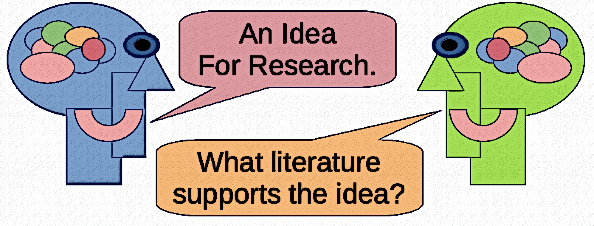

# Junior Seminar (CS580) Assignment 05

What's the Research Gap?

**Assigned** : Tuesday 21 February 2023

**Due** : Thursday 2nd March 2023

## Objectives

* To identify the gap in knowledge which has been motivated by relevant literature. 
* To contemplate the deliverable of your research project 
* To begin considering form of the end-product of your research project.

Figure 1: All research projects begin with a potential idea of a study called a "gap." __The "gap" represents the space between the problem and its explanation, or, equally, the area between knowing and non-knowing.__ 
All work in knowledge gaps must be driven by the facts found in (current) literature. These facts help to determine the frontier between _knowing_ and _not-knowing_, and serve inform you about where your project might begin ...

## Outcomes of Research

In all research, there is some outcome or resulting body of work that is created as a result of a researcher’s investigation, as noted by Figure 1.

In your project, what do you envision will be the resulting deliverable from your work? For example, would the product of your research project be similar to one of the ideas below, or something different?

* A piece of software
* A tool
* A new type of video game
* A component for a game
* A piece of theory
* A method or an analysis to investigate some real-world concept
* A software library
* A data set and its analysis
* Something completely different ...?

Perhaps your deliverable fits into an all-together different category entirely? In some research projects, for example, the deliverable may be a body of text such as a book, or an article, to explain some in-depth aspect of technology in Computer Science. Whatever you plan to produce during the course of your work, _you will need to motivate the work as an original work which is supported by facts found in the literature._

Find the Gap with Motivation From the Literature
A gap in knowledge is described as a missing piece of original information, or the lack of fact, which would connect two current pieces of thought within the research area. Bridging a gap would add knowledge to strengthen the understanding in the area so that current thinking is continuous between these former pieces of knowledge thanks to the added knowledge.

## What To Do

This assignment asks you to consider the product of your project in terms of the facts of the literature to support your work. Here, you are asked to use your previously found literature, in addition to several fresh and current articles in the literature to discuss how your work bridges some type of gap in knowledge.

For instance, upon reading articles in the domain of your idea where it is mentioned that “a workable solution has not yet been found”, you could use this knowledge to propose your research project to find such a workable solution to the problem.

Further ideas about finding a gap in knowledge of your research area may be found at the [Middlebury link](https://sites.middlebury.edu/middsciwriting/overview/organization/gap-statements/).

---

### Part 1: This Class Tuesday: 

In the GitHub repository’s `writing/report.md` document, respond to the prompted questions.

### Part 2: Thursday's Class and Lab:

For our next lab session, you will continue to work on this assignment. Please use the lab time wisely to identify the knowledge gap, motivate it by relevant literature and/or existing projects, and develop your research question(s). You can also use this time to create a cohesive blog (min 200 words) post summarizing your responses.

### Part 3: The Following Class Tuesday

Give a three minute lightning-talk presentation that identifies the gap and the way you will attempt to address it. Note, we may have to continue these lightning talks into Thursday of next week.

---

## Summary of Deliverables

* Complete your Markdown report (`writing/reflection.md`) for the class assignment grade.
* Prepare and give a three (3) minute lightning talk for Next Tuesday's class for a checkmark participation point.
* Add an updated list of keywords to your online research notebook.
* Add a paragraph to your online research page about your plans to _bridge the gap in research__.

## Project Assessment

The grade that a student receives on this assignment will have the following components.

- **GitHub Actions CI Build Status [up to 20%]:**: For the repository associated with this assignment students will receive a checkmark grade if their last before-the-deadline build passes. This is only checking some baseline writing and commit requirements as well as correct running of the program. An additional reduction will given if the commit log shows a cluster of commits at the end clearly used just to pass this requirement. An addition reduction will also be given if there is no commit during lab work times. All other requirements are evaluated manually.

- **Mastery of Technical Writing [up to 50%]:**: Students will also receive a checkmark grade when the responses to the writing questions presented in the `reflection.md` reveal a proficiency of both writing skills and technical knowledge. To receive a checkmark grade, the submitted writing should have correct spelling, grammar, and punctuation in addition to following the rules of Markdown and providing conceptually and technically accurate answers.

- **Presentation [up to 30%]:**
Students will receive a checkmark grade for presentations. Student must be present to receive credit for group's presentation.

## GatorGrade

You can check the baseline writing and commit requirements for this lab assignment by running department's assignment checking `gatorgrade` tool. To use `gatorgrade`, you first need to make sure you have Python3 installed (type `python --version` to check). If you do not have Python installed, please see:

- [Setting Up Python on Windows](https://realpython.com/lessons/python-windows-setup/)
- [Python 3 Installation and Setup Guide](https://realpython.com/installing-python/)
- [How to Install Python 3 and Set Up a Local Programming Environment on Windows 10](https://www.digitalocean.com/community/tutorials/how-to-install-python-3-and-set-up-a-local-programming-environment-on-windows-10)

Then, if you have not done so already, you need to install `gatorgrade`:

- First, [install `pipx`](https://pypa.github.io/pipx/installation/)
- Then, install `gatorgrade` with `pipx install gatorgrade`

Finally, you can run `gatorgrade`:

`gatorgrade --config config/gatorgrade.yml`

## Seeking Assistance

* Extra resources for using markdown include;
  + [Markdown Tidbits](https://www.youtube.com/watch?v=cdJEUAy5IyA)
  + [Markdown Cheatsheet](https://github.com/adam-p/markdown-here/wiki/Markdown-Cheatsheet)
* Do not forget to use the above git commands to push your work to the cloud for the instructor to grade your assignment. You can go to your GitHub repository using your browser to verify that your files have been submitted. Please see the TL’s or the instructor if you have any questions about assignment submission.

Students who have questions about this project outside of the lab time are invited
to ask them in the course's Discord channel or during instructor's or TL's office hours.